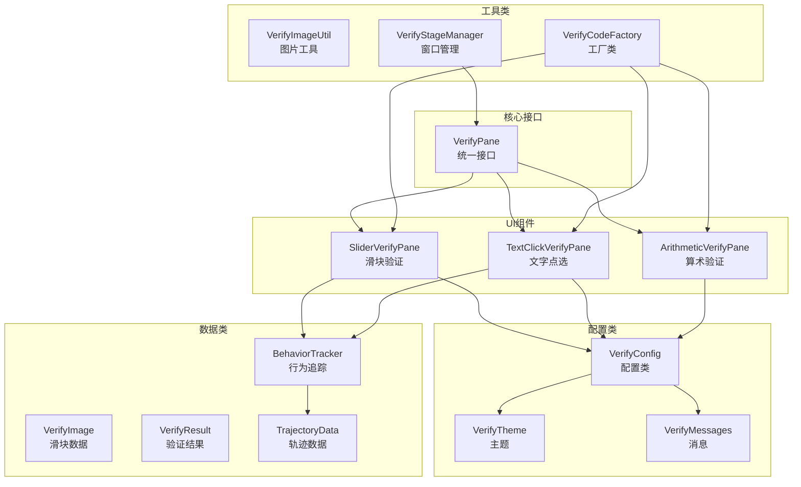
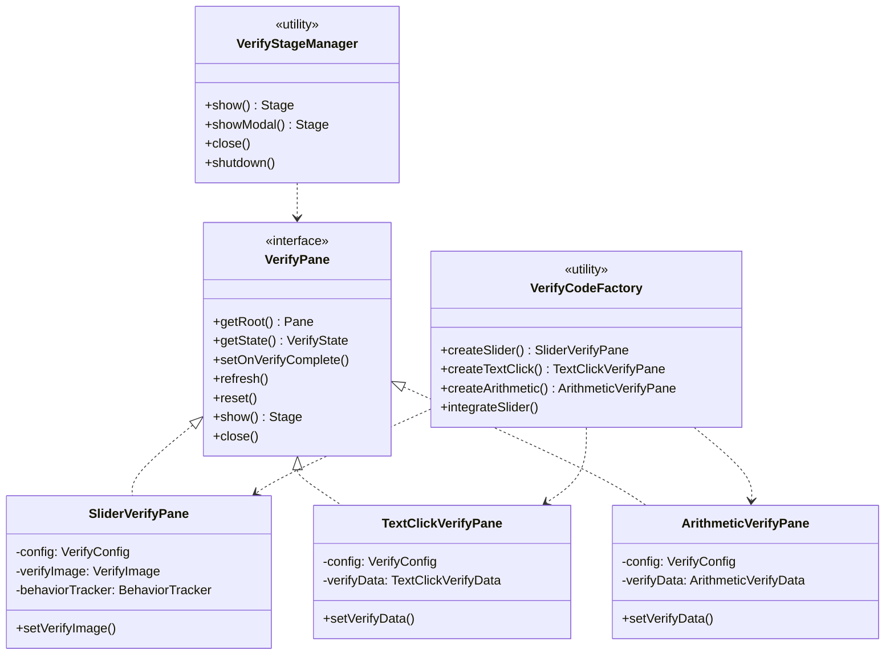

# 验证码组件 API 文档

## 目录

1. [概述](#概述)
2. [组件架构图](#组件架构图)
3. [核心接口](#核心接口)
   - [VerifyPane - 验证码组件统一接口](#verifypane---验证码组件统一接口)
4. [UI组件类](#ui组件类)
   - [SliderVerifyPane - 滑块验证码组件](#sliderverifypane---滑块验证码组件)
   - [TextClickVerifyPane - 文字点选验证码组件](#textclickverifypane---文字点选验证码组件)
   - [ArithmeticVerifyPane - 算术验证码组件](#arithmeticverifypane---算术验证码组件)
5. [工具类](#工具类)
   - [VerifyImageUtil - 验证码图片工具类](#verifyimageutil---验证码图片工具类)
   - [VerifyCodeFactory - 验证码工厂类](#verifycodefactory---验证码工厂类)
   - [VerifyStageManager - 窗口管理器](#verifystagemanager---窗口管理器)
6. [配置类](#配置类)
   - [VerifyConfig - 验证码配置类](#verifyconfig---验证码配置类)
   - [VerifyTheme - 主题配置类](#verifytheme---主题配置类)
   - [VerifyMessages - 消息配置类](#verifymessages---消息配置类)
7. [数据类](#数据类)
   - [VerifyImage - 滑块验证码数据类](#verifyimage---滑块验证码数据类)
   - [VerifyResult - 验证结果类](#verifyresult---验证结果类)
   - [TrajectoryData - 行为轨迹数据类](#trajectorydata---行为轨迹数据类)
   - [BehaviorTracker - 行为追踪器](#behaviortracker---行为追踪器)
8. [枚举类型](#枚举类型)
   - [VerifyType - 验证码类型枚举](#verifytype---验证码类型枚举)
   - [VerifyState - 验证状态枚举](#verifystate---验证状态枚举)
9. [异常类](#异常类)
   - [VerifyException - 验证码异常类](#verifyexception---验证码异常类)
10. [使用场景示例](#使用场景示例)
11. [错误处理与异常](#错误处理与异常)
12. [组件间关系](#组件间关系)
13. [性能考虑与最佳实践](#性能考虑与最佳实践)

---

## 概述

本验证码组件是一个功能完整的 Java/JavaFX 验证码生成与验证系统，支持三种验证码类型：

| 类型 | 组件类 | 描述 | 适用场景 |
|------|--------|------|----------|
| **滑动拼图验证码** | SliderVerifyPane | 用户拖动滑块拼图到正确位置 | 登录验证、支付验证 |
| **文字点选验证码** | TextClickVerifyPane | 用户按顺序点击图片中的指定文字 | 防机器人验证、注册验证 |
| **算术验证码** | ArithmeticVerifyPane | 用户输入数学算式的答案 | 表单验证、低安全级别场景 |

### 主要特性

- 支持三种验证码类型
- 统一的 VerifyPane 接口
- 可配置难度级别（简单/中等/困难）
- 支持主题定制（浅色/深色/蓝色/绿色）
- 支持国际化（中文/英文）
- 行为轨迹追踪与反机器人检测
- 支持 Base64 图片编码
- 独立窗口显示与模态窗口支持
- 线程安全设计

---

## 组件架构图



---

## 核心接口

### VerifyPane - 验证码组件统一接口

**完整类名**: `com.javafx.test.verifyCode.VerifyPane`

**用途**: 所有验证码组件必须实现的统一接口，定义了验证码组件的基本行为。

**接口定义**:
```java
public interface VerifyPane
```

#### 核心方法

| 方法名 | 返回类型 | 参数 | 说明 |
|--------|----------|------|------|
| getRoot() | Pane | 无 | 获取验证码组件的根容器，可直接添加到场景中 |
| getState() | VerifyState | 无 | 获取当前验证状态 |
| stateProperty() | ObjectProperty\<VerifyState\> | 无 | 获取验证状态属性（用于绑定） |
| setOnVerifyComplete() | void | Consumer\<VerifyResult\> | 设置验证完成回调 |
| getOnVerifyComplete() | Consumer\<VerifyResult\> | 无 | 获取验证完成回调 |
| setOnRefresh() | void | Runnable | 设置刷新回调 |
| refresh() | void | 无 | 刷新验证码 |
| reset() | void | 无 | 重置验证码状态 |
| getConfig() | VerifyConfig | 无 | 获取验证码配置 |

#### 窗口显示方法（默认方法）

| 方法名 | 返回类型 | 参数 | 说明 |
|--------|----------|------|------|
| show() | Stage | 无 | 显示验证码窗口 |
| show(width, height) | Stage | double, double | 显示指定尺寸的窗口 |
| show(width, height, title) | Stage | double, double, String | 显示指定尺寸和标题的窗口 |
| showModal(parentStage) | Stage | Stage | 显示模态窗口 |
| showModal(parentStage, width, height) | Stage | Stage, double, double | 显示指定尺寸的模态窗口 |
| close() | void | 无 | 关闭验证码窗口 |
| isShowing() | boolean | 无 | 检查窗口是否正在显示 |
| getStage() | Stage | 无 | 获取对应的窗口 |

#### 使用示例

```java
import com.javafx.test.verifyCode.*;
import javafx.application.Application;
import javafx.scene.Scene;
import javafx.scene.layout.VBox;
import javafx.stage.Stage;

import java.io.IOException;
import java.util.Arrays;

public class QuickStart extends Application {

    @Override
    public void start(Stage primaryStage) {
        // 1. 创建配置（指定背景图片）
        VerifyConfig config = VerifyConfig.createSlider()
                .size(350, 200)
                .backgroundImages(Arrays.asList(
                        "D:/images/bg1.jpg"  // 替换为您的图片路径
                ));

        // 2. 创建验证码组件
        SliderVerifyPane sliderPane = new SliderVerifyPane(config);

        // 3. 设置验证完成回调
        sliderPane.setOnVerifyComplete(result -> {
            if (result.isSuccess()) {
                System.out.println("✅ 验证成功！");
            } else {
                System.out.println("❌ 验证失败：" + result.getMessage());
            }
        });

        // 4. 加载验证码图片
        try {
            VerifyImage image = VerifyImageUtil.generateSliderVerifyImage(
                    config.getRandomBackgroundImage(),
                    config
            );
            sliderPane.setVerifyImage(image);
        } catch (IOException e) {
            System.out.println("加载验证码失败：" + e.getMessage());
        }

        // 5. 添加到界面
        VBox root = new VBox(20);
        root.getChildren().add(sliderPane);

        Scene scene = new Scene(root, 450, 350);
        primaryStage.setScene(scene);
        primaryStage.setTitle("验证码演示");
        primaryStage.show();
    }

    public static void main(String[] args) {
        launch(args);
    }
}
```

---

## UI组件类

### SliderVerifyPane - 滑块验证码组件

**完整类名**: `com.javafx.test.verifyCode.SliderVerifyPane`

**用途**: 提供类似极验的滑块验证功能。

**类定义**:
```java
public class SliderVerifyPane extends VBox implements VerifyPane
```

#### 构造方法

| 构造方法 | 参数 | 说明 |
|----------|------|------|
| SliderVerifyPane() | 无 | 使用默认配置创建 |
| SliderVerifyPane(VerifyConfig config) | VerifyConfig | 使用指定配置创建 |

#### 特有方法

| 方法名 | 返回类型 | 参数 | 说明 |
|--------|----------|------|------|
| setVerifyImage() | void | VerifyImage | 设置验证码图片数据 |
| getVerifyImage() | VerifyImage | 无 | 获取当前验证码图片 |

#### 属性详解

| 属性名 | 类型 | 默认值 | 说明 |
|--------|------|--------|------|
| config | VerifyConfig | - | 验证码配置 |
| verifyImage | VerifyImage | null | 验证码图片数据 |
| state | ObjectProperty\<VerifyState\> | READY | 验证状态 |
| onVerifyComplete | Consumer\<VerifyResult\> | null | 验证完成回调 |
| onRefresh | Runnable | null | 刷新回调 |

#### 常量定义

| 常量名 | 值 | 说明 |
|--------|-----|------|
| FAIL_RESET_DELAY_MS | 1500 | 验证失败后自动重置的延迟时间（毫秒） |

#### 使用示例

```java
// 创建配置
VerifyConfig config = VerifyConfig.slider()
    .size(350, 200)
    .sliderSize(50, 50)
    .tolerance(8)
    .backgroundImages(backgroundImages)
    .theme(VerifyTheme.BLUE);

// 创建组件
SliderVerifyPane pane = new SliderVerifyPane(config);

// 生成并设置验证码图片
VerifyImage verifyImage = VerifyImageUtil.generateSliderVerifyImage(config);
pane.setVerifyImage(verifyImage);

// 设置回调
pane.setOnVerifyComplete(result -> {
    if (result.isSuccess()) {
        System.out.println("验证成功！耗时: " + result.getDuration() + "ms");
    }
});

// 设置刷新回调
pane.setOnRefresh(() -> {
    try {
        VerifyImage newImage = VerifyImageUtil.generateSliderVerifyImage(config);
        pane.setVerifyImage(newImage);
    } catch (Exception e) {
        e.printStackTrace();
    }
});
```

---

#### 完整示例

```java
import com.javafx.test.verifyCode.*;
import javafx.application.Application;
import javafx.application.Platform;
import javafx.scene.Scene;
import javafx.scene.control.Label;
import javafx.scene.layout.VBox;
import javafx.stage.Stage;

import java.io.IOException;
import java.util.Arrays;

public class SliderDemo extends Application {

    private Label statusLabel;
    private SliderVerifyPane sliderPane;

    @Override
    public void start(Stage primaryStage) {
        VBox root = new VBox(20);
        root.setStyle("-fx-padding: 20; -fx-alignment: center;");

        // 状态标签
        statusLabel = new Label("请拖动滑块完成拼图");

        // 创建配置
        VerifyConfig config = VerifyConfig.createSlider()
                .size(400, 250)
                .tolerance(10)
                .difficulty(2)
                .theme(VerifyTheme.BLUE)
                .backgroundImages(Arrays.asList(
                        "D:/images/bg1.jpg",
                        "D:/images/bg2.jpg",
                        "D:/images/bg3.jpg"
                ));

        // 创建组件
        sliderPane = new SliderVerifyPane(config);

        // 设置验证回调
        sliderPane.setOnVerifyComplete(result -> {
            handleVerifyResult(result);
        });

        // 设置刷新回调
        sliderPane.setOnRefresh(() -> {
            refreshVerifyImage();
        });

        // 初始化验证码
        refreshVerifyImage();

        root.getChildren().addAll(sliderPane, statusLabel);

        Scene scene = new Scene(root, 500, 400);
        primaryStage.setScene(scene);
        primaryStage.setTitle("滑动拼图验证码");
        primaryStage.show();
    }

    private void handleVerifyResult(VerifyResult result) {
        Platform.runLater(() -> {
            if (result.isSuccess()) {
                statusLabel.setText("✅ 验证成功！耗时：" + result.getDuration() + "ms");
                statusLabel.setStyle("-fx-text-fill: #52c41a;");
            } else {
                statusLabel.setText("❌ 验证失败：" + result.getMessage());
                statusLabel.setStyle("-fx-text-fill: #ff4d4f;");

                // 延迟刷新
                new Thread(() -> {
                    try {
                        Thread.sleep(1500);
                    } catch (InterruptedException e) {
                        Thread.currentThread().interrupt();
                    }
                    Platform.runLater(() -> sliderPane.refresh());
                }).start();
            }
        });
    }

    private void refreshVerifyImage() {
        try {
            String imagePath = config.getRandomBackgroundImage();
            VerifyImage image = VerifyImageUtil.generateSliderVerifyImage(imagePath, config);
            sliderPane.setVerifyImage(image);
            statusLabel.setText("请拖动滑块完成拼图");
            statusLabel.setStyle("-fx-text-fill: #666;");
        } catch (IOException e) {
            statusLabel.setText("加载验证码失败：" + e.getMessage());
            statusLabel.setStyle("-fx-text-fill: #ff4d4f;");
        }
    }

    public static void main(String[] args) {
        launch(args);
    }
}
```


### TextClickVerifyPane - 文字点选验证码组件

**完整类名**: `com.javafx.test.verifyCode.TextClickVerifyPane`

**用途**: 用户需要按顺序点击指定的文字。

**类定义**:
```java
public class TextClickVerifyPane extends VBox implements VerifyPane
```

#### 构造方法

| 构造方法 | 参数 | 说明 |
|----------|------|------|
| TextClickVerifyPane() | 无 | 使用默认配置创建 |
| TextClickVerifyPane(VerifyConfig config) | VerifyConfig | 使用指定配置创建 |

#### 特有方法

| 方法名 | 返回类型 | 参数 | 说明 |
|--------|----------|------|------|
| setVerifyData() | void | TextClickVerifyData | 设置验证码数据 |

#### 配置依赖

- `srcWidth`: 图片宽度
- `srcHeight`: 图片高度
- `clickTextCount`: 需点击的文字数量（默认3）
- `interferenceTextCount`: 干扰文字数量（默认5）
- `textPool`: 文字池
- `fontSizeRange`: 字体大小范围 [16, 24]
- `tolerance`: 容差值（默认15）

#### 使用示例

```java
// 创建配置
VerifyConfig config = VerifyConfig.textClick()
    .size(350, 200)
    .clickTextCount(3)
    .interferenceTextCount(5)
    .tolerance(15)
    .textPool(Arrays.asList("春", "夏", "秋", "冬", "风", "花", "雪", "月"));

// 创建组件
TextClickVerifyPane pane = new TextClickVerifyPane(config);

// 生成验证码
VerifyImageUtil.TextClickVerifyData data = 
    VerifyImageUtil.generateTextClickVerify(config);
pane.setVerifyData(data);

// 设置回调
pane.setOnVerifyComplete(result -> {
    if (result.isSuccess()) {
        System.out.println("点击验证成功！");
    }
});
```

---

#### 完整示例

```java
import com.javafx.test.verifyCode.*;
import javafx.application.Application;
import javafx.application.Platform;
import javafx.scene.Scene;
import javafx.scene.control.Label;
import javafx.scene.layout.VBox;
import javafx.stage.Stage;

public class TextClickDemo extends Application {

    private Label statusLabel;
    private TextClickVerifyPane textPane;
    private VerifyConfig config;

    @Override
    public void start(Stage primaryStage) {
        VBox root = new VBox(20);
        root.setStyle("-fx-padding: 20; -fx-alignment: center;");

        statusLabel = new Label("请按顺序点击图中文字");

        // 创建配置
        config = VerifyConfig.createTextClick()
                .size(350, 200)
                .clickTextCount(3)
                .interferenceTextCount(5)
                .tolerance(15)
                .textPool(Arrays.asList(
                        "春", "夏", "秋", "冬", "风", "花", "雪", "月"
                ));

        // 创建组件
        textPane = new TextClickVerifyPane(config);

        // 设置回调
        textPane.setOnVerifyComplete(result -> {
            handleVerifyResult(result);
        });

        textPane.setOnRefresh(() -> {
            refreshVerifyData();
        });

        // 初始化
        refreshVerifyData();

        root.getChildren().addAll(textPane, statusLabel);

        Scene scene = new Scene(root, 450, 400);
        primaryStage.setScene(scene);
        primaryStage.setTitle("文字点选验证码");
        primaryStage.show();
    }

    private void handleVerifyResult(VerifyResult result) {
        Platform.runLater(() -> {
            if (result.isSuccess()) {
                statusLabel.setText("✅ 验证成功！");
                statusLabel.setStyle("-fx-text-fill: #52c41a;");
            } else {
                statusLabel.setText("❌ " + result.getMessage());
                statusLabel.setStyle("-fx-text-fill: #ff4d4f;");

                // 延迟刷新
                new Thread(() -> {
                    try {
                        Thread.sleep(1500);
                    } catch (InterruptedException e) {
                        Thread.currentThread().interrupt();
                    }
                    Platform.runLater(() -> textPane.refresh());
                }).start();
            }
        });
    }

    private void refreshVerifyData() {
        VerifyImageUtil.TextClickVerifyData data =
                VerifyImageUtil.generateTextClickVerify(config);
        textPane.setVerifyData(data);
        statusLabel.setText("请按顺序点击图中文字");
        statusLabel.setStyle("-fx-text-fill: #666;");
    }

    public static void main(String[] args) {
        launch(args);
    }
}
```

### ArithmeticVerifyPane - 算术验证码组件

**完整类名**: `com.javafx.test.verifyCode.ArithmeticVerifyPane`

**用途**: 用户需要计算并输入正确的数学运算结果。

**类定义**:
```java
public class ArithmeticVerifyPane extends VBox implements VerifyPane
```

#### 构造方法

| 构造方法 | 参数 | 说明 |
|----------|------|------|
| ArithmeticVerifyPane() | 无 | 使用默认配置创建 |
| ArithmeticVerifyPane(VerifyConfig config) | VerifyConfig | 使用指定配置创建 |

#### 特有方法

| 方法名 | 返回类型 | 参数 | 说明 |
|--------|----------|------|------|
| setVerifyData() | void | ArithmeticVerifyData | 设置验证码数据 |
| getExpression() | String | 无 | 获取当前算式 |

#### 配置依赖

- `srcWidth`: 图片宽度
- `srcHeight`: 图片高度
- `operators`: 运算符列表（支持 "+", "-", "×", "÷"）
- `numberRange`: 数字范围 [1, 50]

#### 使用示例

```java
// 创建配置
VerifyConfig config = VerifyConfig.arithmetic()
    .size(200, 100)
    .operators(Arrays.asList("+", "-", "×"))
    .numberRange(1, 50);

// 创建组件
ArithmeticVerifyPane pane = new ArithmeticVerifyPane(config);

// 生成验证码
VerifyImageUtil.ArithmeticVerifyData data = 
    VerifyImageUtil.generateArithmeticVerify(config);
pane.setVerifyData(data);

System.out.println("算式: " + data.getExpression());
System.out.println("答案: " + data.getAnswer());

// 设置回调
pane.setOnVerifyComplete(result -> {
    if (result.isSuccess()) {
        System.out.println("答案正确！");
    } else {
        System.out.println("答案错误！");
    }
});
```

---

#### 完整示例

```java
import com.javafx.test.verifyCode.*;
import javafx.application.Application;
import javafx.application.Platform;
import javafx.scene.Scene;
import javafx.scene.control.Label;
import javafx.scene.layout.VBox;
import javafx.stage.Stage;

import java.util.Arrays;

public class ArithmeticDemo extends Application {

    private Label statusLabel;
    private ArithmeticVerifyPane arithmeticPane;
    private VerifyConfig config;

    @Override
    public void start(Stage primaryStage) {
        VBox root = new VBox(20);
        root.setStyle("-fx-padding: 20; -fx-alignment: center;");

        statusLabel = new Label("请计算并输入结果");

        // 创建配置
        config = VerifyConfig.createArithmetic()
                .numberRange(10, 99)
                .operators(Arrays.asList("+", "-", "×"))
                .allowNegativeResult(false);

        // 创建组件
        arithmeticPane = new ArithmeticVerifyPane(config);

        // 设置回调
        arithmeticPane.setOnVerifyComplete(result -> {
            handleVerifyResult(result);
        });

        arithmeticPane.setOnRefresh(() -> {
            refreshVerifyData();
        });

        // 初始化
        refreshVerifyData();

        root.getChildren().addAll(arithmeticPane, statusLabel);

        Scene scene = new Scene(root, 400, 350);
        primaryStage.setScene(scene);
        primaryStage.setTitle("算术验证码");
        primaryStage.show();
    }

    private void handleVerifyResult(VerifyResult result) {
        Platform.runLater(() -> {
            if (result.isSuccess()) {
                statusLabel.setText("✅ 回答正确！");
                statusLabel.setStyle("-fx-text-fill: #52c41a;");
            } else {
                statusLabel.setText("❌ " + result.getMessage());
                statusLabel.setStyle("-fx-text-fill: #ff4d4f;");

                // 延迟刷新
                new Thread(() -> {
                    try {
                        Thread.sleep(1500);
                    } catch (InterruptedException e) {
                        Thread.currentThread().interrupt();
                    }
                    Platform.runLater(() -> arithmeticPane.refresh());
                }).start();
            }
        });
    }

    private void refreshVerifyData() {
        VerifyImageUtil.ArithmeticVerifyData data =
                VerifyImageUtil.generateArithmeticVerify(config);
        arithmeticPane.setVerifyData(data);
        statusLabel.setText("请计算并输入结果");
        statusLabel.setStyle("-fx-text-fill: #666;");
    }

    public static void main(String[] args) {
        launch(args);
    }
}
```

## 工具类

### VerifyImageUtil - 验证码图片工具类

**完整类名**: `com.javafx.test.verifyCode.VerifyImageUtil`

**用途**: 提供验证码图片生成、裁剪、编码等功能。

#### 常量定义

| 常量名 | 类型 | 默认值 | 说明 |
|--------|------|--------|------|
| DEFAULT_SRC_WIDTH | int | 350 | 默认源图片宽度（像素） |
| DEFAULT_SRC_HEIGHT | int | 200 | 默认源图片高度（像素） |
| DEFAULT_SLIDER_WIDTH | int | 50 | 默认滑块宽度（像素） |
| DEFAULT_SLIDER_HEIGHT | int | 50 | 默认滑块高度（像素） |
| DEFAULT_CIRCLE_RADIUS | int | 5 | 默认凸起圆心半径（像素） |
| DEFAULT_RECTANGLE_PADDING | int | 8 | 默认内边距（像素） |
| DEFAULT_OUT_PADDING | int | 1 | 默认边框宽度（像素） |

#### 核心方法

##### 滑块验证码生成

```java
// 根据配置生成
public static VerifyImage generateSliderVerifyImage(VerifyConfig config) throws IOException

// 根据文件路径生成
public static VerifyImage generateSliderVerifyImage(String filePath, VerifyConfig config) throws IOException

// 使用默认配置生成
public static VerifyImage generateSliderVerifyImage(String filePath) throws IOException

// 根据场景尺寸生成
public static VerifyImage generateSliderVerifyImage(String filePath, double sceneWidth, double sceneHeight) throws IOException
```

**参数说明**:

| 参数名 | 类型 | 必填 | 说明 |
|--------|------|------|------|
| config | VerifyConfig | 是 | 验证码配置对象 |
| filePath | String | 是 | 图片路径（支持URL/classpath/本地文件） |
| sceneWidth | double | 是 | 场景宽度 |
| sceneHeight | double | 是 | 场景高度 |

**支持的文件路径格式**:
- HTTP/HTTPS URL: `http://example.com/image.jpg`
- File URL: `file:/path/to/image.jpg`
- JAR URL: `jar:file:/path/to/archive.jar!/image.jpg`
- Classpath: `img/background.jpg`
- 本地文件: `C:/images/background.jpg`

##### 文字点选验证码生成

```java
public static TextClickVerifyData generateTextClickVerify(VerifyConfig config)
```

##### 算术验证码生成

```java
public static ArithmeticVerifyData generateArithmeticVerify(VerifyConfig config)
```

##### 图片处理工具方法

```java
// 调整图片尺寸
public static BufferedImage resizeImage(BufferedImage srcImage, int width, int height)

// 图片转Base64
public static String imageToBase64(BufferedImage image) throws IOException

// Base64转图片
public static BufferedImage base64ToImage(String base64String)

// 随机获取目录中的图片
public static BufferedImage getRandomImage(String directoryPath) throws IOException

// 保存图片到文件
public static void saveImage(BufferedImage image, String filePath) throws IOException
```

---

### VerifyCodeFactory - 验证码工厂类

**完整类名**: `com.javafx.test.verifyCode.VerifyCodeFactory`

**用途**: 提供统一的验证码组件创建入口，简化组件创建流程。

**类定义**:
```java
public final class VerifyCodeFactory
```

#### 滑块验证码创建

```java
// 使用默认配置
public static SliderVerifyPane createSlider(List<String> backgroundImages)

// 使用指定配置
public static SliderVerifyPane createSlider(VerifyConfig config)

// 设置回调
public static SliderVerifyPane createSlider(VerifyConfig config, Consumer<VerifyResult> onVerifyComplete)

// 完整参数
public static SliderVerifyPane createSlider(List<String> backgroundImages, 
    int width, int height, int tolerance, Consumer<VerifyResult> onVerifyComplete)
```

#### 文字点选验证码创建

```java
// 使用默认配置
public static TextClickVerifyPane createTextClick()

// 使用指定配置
public static TextClickVerifyPane createTextClick(VerifyConfig config)

// 设置回调
public static TextClickVerifyPane createTextClick(VerifyConfig config, 
    Consumer<VerifyResult> onVerifyComplete)
```

#### 算术验证码创建

```java
// 使用默认配置
public static ArithmeticVerifyPane createArithmetic()

// 使用指定配置
public static ArithmeticVerifyPane createArithmetic(VerifyConfig config)

// 设置回调
public static ArithmeticVerifyPane createArithmetic(VerifyConfig config, 
    Consumer<VerifyResult> onVerifyComplete)
```

#### 通用创建方法

```java
// 根据类型创建
public static Pane create(VerifyType type, VerifyConfig config)

// 创建随机类型
public static Pane createRandom(VerifyConfig config)
public static Pane createRandom()
```

#### 快速集成方法

```java
// 快速集成滑块验证码
public static SliderVerifyPane integrateSlider(Pane container, 
    List<String> backgroundImages, Consumer<VerifyResult> onVerifyComplete)

// 快速集成文字点选验证码
public static TextClickVerifyPane integrateTextClick(Pane container, 
    Consumer<VerifyResult> onVerifyComplete)

// 快速集成算术验证码
public static ArithmeticVerifyPane integrateArithmetic(Pane container, 
    Consumer<VerifyResult> onVerifyComplete)
```

#### 使用示例

```java
// 方式1：快速创建
SliderVerifyPane slider = VerifyCodeFactory.createSlider(backgroundImages);
slider.setOnVerifyComplete(result -> {
    if (result.isSuccess()) {
        System.out.println("验证成功！");
    }
});

// 方式2：使用自定义配置
VerifyConfig config = VerifyConfig.slider()
    .size(400, 250)
    .tolerance(10)
    .theme(VerifyTheme.BLUE);
SliderVerifyPane slider = VerifyCodeFactory.createSlider(config);

// 方式3：快速集成到容器
VBox container = new VBox();
VerifyCodeFactory.integrateSlider(container, backgroundImages, result -> {
    if (result.isSuccess()) {
        // 验证成功，继续业务流程
    }
});

// 方式4：创建随机类型
Pane randomPane = VerifyCodeFactory.createRandom();
```

---

### VerifyStageManager - 窗口管理器

**完整类名**: `com.javafx.test.verifyCode.VerifyStageManager`

**用途**: 提供验证码组件的显示和关闭功能，支持多窗口管理和线程安全操作。

**类定义**:
```java
public class VerifyStageManager
```

#### 常量定义

| 常量名 | 值 | 说明 |
|--------|-----|------|
| DEFAULT_WIDTH | 420 | 默认窗口宽度 |
| DEFAULT_HEIGHT | 320 | 默认窗口高度 |
| DEFAULT_TITLE | "验证码验证" | 默认窗口标题 |
| CLOSE_DELAY_MS | 800 | 验证成功后延迟关闭时间（毫秒） |

#### 显示方法

```java
// 显示验证码窗口
public static Stage show(VerifyPane verifyPane)

// 指定尺寸显示
public static Stage show(VerifyPane verifyPane, double width, double height)

// 指定尺寸和标题显示
public static Stage show(VerifyPane verifyPane, double width, double height, String title)

// 显示模态窗口
public static Stage showModal(VerifyPane verifyPane, Stage parentStage)

// 显示模态窗口（指定尺寸）
public static Stage showModal(VerifyPane verifyPane, Stage parentStage, double width, double height)
```

#### 管理方法

```java
// 关闭验证码窗口
public static void close(VerifyPane verifyPane)

// 检查是否正在显示
public static boolean isShowing(VerifyPane verifyPane)

// 获取对应的窗口
public static Stage getStage(VerifyPane verifyPane)

// 关闭所有验证码窗口
public static void closeAll()

// 关闭调度器，释放资源
public static void shutdown()
```

#### 使用示例

```java
SliderVerifyPane pane = new SliderVerifyPane(config);

// 方式1：通过 VerifyPane 的默认方法
pane.show();
pane.showModal(parentStage);

// 方式2：通过 VerifyStageManager 静态方法
VerifyStageManager.show(pane);
VerifyStageManager.show(pane, 400, 300, "安全验证");
VerifyStageManager.showModal(pane, parentStage);

// 检查窗口状态
if (pane.isShowing()) {
    pane.close();
}

// 应用退出时释放资源
VerifyStageManager.shutdown();
```

---

## 配置类

### VerifyConfig - 验证码配置类

**完整类名**: `com.javafx.test.verifyCode.VerifyConfig`

**用途**: 验证码配置类，用于定义验证码的各项参数。

**类定义**:
```java
public class VerifyConfig implements Cloneable
```

#### 构造方法

| 构造方法 | 参数 | 说明 |
|----------|------|------|
| VerifyConfig() | 无 | 创建默认配置（SLIDER类型） |
| VerifyConfig(VerifyType verifyType) | VerifyType | 创建指定类型配置 |

#### 静态工厂方法

```java
public static VerifyConfig slider()     // 滑块验证码配置
public static VerifyConfig textClick()  // 文字点选验证码配置
public static VerifyConfig arithmetic() // 算术验证码配置
public static VerifyConfig mixed()      // 混合验证码配置

public static VerifyConfig createDefault(VerifyType type)
public static VerifyConfig createSlider()
public static VerifyConfig createTextClick()
public static VerifyConfig createArithmetic()
public static VerifyConfig createMixed()
```

#### 属性详解

##### 通用配置属性

| 属性名 | 类型 | 默认值 | 说明 |
|--------|------|--------|------|
| verifyType | VerifyType | SLIDER | 验证码类型 |
| difficulty | int | 1 | 难度级别（1-简单, 2-中等, 3-困难） |
| tolerance | int | 8 | 验证容差值（像素） |
| enableBehaviorTracking | boolean | true | 是否启用行为轨迹检测 |
| backgroundImages | List\<String\> | null | 背景图片路径列表 |

##### 滑块验证码属性

| 属性名 | 类型 | 默认值 | 说明 |
|--------|------|--------|------|
| srcWidth | int | 350 | 背景图宽度（像素） |
| srcHeight | int | 200 | 背景图高度（像素） |
| sliderWidth | int | 50 | 滑块宽度（像素） |
| sliderHeight | int | 50 | 滑块高度（像素） |
| circleRadius | int | 5 | 滑块凸起圆半径（像素） |
| rectanglePadding | int | 8 | 滑块内边距（像素） |

##### 文字点选验证码属性

| 属性名 | 类型 | 默认值 | 说明 |
|--------|------|--------|------|
| clickTextCount | int | 3 | 需点击的文字数量 |
| interferenceTextCount | int | 5 | 干扰文字数量 |
| fontSizeRange | int[] | {16, 24} | 字体大小范围 [最小, 最大] |
| textColor | Color | BLACK | 文字颜色 |
| textPool | List\<String\> | 24个汉字 | 文字池 |

##### 算术验证码属性

| 属性名 | 类型 | 默认值 | 说明 |
|--------|------|--------|------|
| operators | List\<String\> | ["+", "-", "×"] | 运算符列表 |
| numberRange | int[] | {1, 50} | 数字范围 [最小, 最大] |
| allowNegativeResult | boolean | false | 是否允许负数结果 |

##### 主题与国际化属性

| 属性名 | 类型 | 默认值 | 说明 |
|--------|------|--------|------|
| theme | VerifyTheme | DEFAULT | 主题配置 |
| locale | Locale | 系统默认 | 语言区域 |
| messages | VerifyMessages | new VerifyMessages() | 自定义提示文本 |

##### 缓存属性

| 属性名 | 类型 | 默认值 | 说明 |
|--------|------|--------|------|
| enableCache | boolean | true | 是否启用图片缓存 |
| maxCacheSize | int | 10 | 缓存最大数量 |

#### Builder 风格方法

```java
VerifyConfig config = VerifyConfig.slider()
    .size(400, 250)
    .sliderSize(60, 60)
    .tolerance(10)
    .difficulty(2)
    .backgroundImages(backgroundImages)
    .enableBehaviorTracking(true)
    .theme(VerifyTheme.BLUE)
    .locale(Locale.CHINA)
    .enableCache(true)
    .maxCacheSize(20);
```

#### 难度调整

```java
// 根据难度调整参数
public void applyDifficulty()
```

**各级别参数对照表**:

| 参数 | 简单(1) | 中等(2) | 困难(3) |
|------|---------|---------|---------|
| 容差(滑块) | 10px | 8px | 5px |
| 容差(文字) | 20px | 15px | 10px |
| 点击文字数 | 2 | 3 | 4 |
| 干扰文字数 | 3 | 5 | 8 |
| 数字范围 | 1-20 | 1-50 | 1-100 |

---

### VerifyTheme - 主题配置类

**完整类名**: `com.javafx.test.verifyCode.VerifyTheme`

**用途**: 定义验证码界面的视觉主题。

#### 预设主题

| 主题常量 | 说明 | 主色调 |
|----------|------|--------|
| DEFAULT | 默认浅色主题 | #1e90ff（蓝色） |
| DARK | 深色主题 | #4361ee |
| BLUE | 蓝色主题 | #1890ff |
| GREEN | 绿色主题 | #52c41a |

#### 颜色属性

| 属性名 | 类型 | 默认值 | 说明 |
|--------|------|--------|------|
| primaryColor | Color | #1e90ff | 主色调 |
| successColor | Color | #52c41a | 成功颜色 |
| errorColor | Color | #ff4d4f | 失败颜色 |
| warningColor | Color | #faad14 | 警告颜色 |
| backgroundColor | Color | #f5f5f5 | 背景颜色 |
| cardBackgroundColor | Color | #ffffff | 卡片背景颜色 |
| textColor | Color | #333333 | 文字颜色 |
| secondaryTextColor | Color | #999999 | 次要文字颜色 |
| borderColor | Color | #e0e0e0 | 边框颜色 |
| sliderTrackColor | Color | #f0f0f0 | 滑块轨道颜色 |
| sliderThumbColor | Color | #ffffff | 滑块按钮颜色 |

#### Builder 模式

```java
VerifyTheme customTheme = VerifyTheme.builder()
    .primaryColor(Color.valueOf("#ff6600"))
    .successColor(Color.valueOf("#00cc66"))
    .errorColor(Color.valueOf("#ff3333"))
    .backgroundColor(Color.valueOf("#fff8f0"))
    .borderRadius(12)
    .fontFamily("SimHei")
    .baseFontSize(15)
    .build();
```

---

### VerifyMessages - 消息配置类

**完整类名**: `com.javafx.test.verifyCode.VerifyMessages`

**用途**: 管理验证码界面显示的文本消息，支持国际化。

#### 默认消息值

| 属性 | 默认值（中文） |
|------|----------------|
| sliderHint | 向右滑动完成验证 |
| textClickHint | 请依次点击图中文字 |
| arithmeticHint | 请输入计算结果 |
| successMessage | 验证成功 |
| failMessage | 验证失败，请重试 |
| robotDetectedMessage | 验证失败，请手动操作 |
| positionMismatchMessage | 位置不正确，请重试 |
| refreshButtonText | 刷新 |
| verifyingMessage | 验证中... |
| loadingMessage | 加载中... |

#### 使用示例

```java
VerifyMessages messages = new VerifyMessages()
    .sliderHint("拖动滑块到正确位置")
    .successMessage("恭喜，验证通过！")
    .failMessage("很遗憾，验证失败");

VerifyConfig config = VerifyConfig.slider()
    .locale(Locale.US)
    .messages(messages);
```

---

## 数据类

### VerifyImage - 滑块验证码数据类

**完整类名**: `com.javafx.test.verifyCode.VerifyImage`

**用途**: 存储滑块验证码的图片数据和位置信息。

#### 属性

| 属性名 | 类型 | 说明 |
|--------|------|------|
| srcImage | String | 原图 Base64 编码 |
| cutImage | String | 滑块图片 Base64 编码 |
| xPosition | Integer | 滑块正确 X 坐标位置 |
| yPosition | Integer | 滑块正确 Y 坐标位置 |
| srcImageWidth | Integer | 背景图宽度 |
| srcImageHeight | Integer | 背景图高度 |
| sliderWidth | Integer | 滑块宽度 |
| sliderHeight | Integer | 滑块高度 |

#### 验证方法

```java
// 验证滑块位置
public boolean verify(int userX, int tolerance)

// 使用默认容差验证
public boolean verify(int userX)
```

#### BufferedImage 缓存方法

```java
public BufferedImage getSrcBufferedImage()  // 获取原图（带缓存）
public BufferedImage getCutBufferedImage()  // 获取滑块图（带缓存）
```

---

### VerifyResult - 验证结果类

**完整类名**: `com.javafx.test.verifyCode.VerifyResult`

**用途**: 存储验证结果信息。

#### 属性

| 属性名 | 类型 | 说明 |
|--------|------|------|
| success | boolean | 验证是否成功 |
| message | String | 结果消息 |
| duration | long | 验证耗时（毫秒） |
| trajectoryData | TrajectoryData | 行为轨迹数据 |
| verifyType | VerifyType | 验证码类型 |
| errorCode | String | 错误代码 |

#### 静态工厂方法

```java
public static VerifyResult success()
public static VerifyResult success(String message)
public static VerifyResult fail(String message)
public static VerifyResult fail(String message, String errorCode)
```

#### 使用示例

```java
pane.setOnVerifyComplete(result -> {
    System.out.println("成功: " + result.isSuccess());
    System.out.println("消息: " + result.getMessage());
    System.out.println("耗时: " + result.getDuration() + "ms");
    System.out.println("类型: " + result.getVerifyType());
    
    if (!result.isSuccess()) {
        System.out.println("错误代码: " + result.getErrorCode());
    }
    
    // 获取行为轨迹数据
    TrajectoryData trajectory = result.getTrajectoryData();
    if (trajectory != null) {
        System.out.println("轨迹点数: " + trajectory.getPointCount());
        System.out.println("疑似机器人: " + trajectory.isRobotSuspected());
    }
});
```

---

### TrajectoryData - 行为轨迹数据类

**完整类名**: `com.javafx.test.verifyCode.TrajectoryData`

**用途**: 记录和分析用户交互行为，实现反机器人检测。

#### 属性

| 属性名 | 类型 | 说明 |
|--------|------|------|
| points | List\<TrajectoryPoint\> | 轨迹点列表 |
| startTime | long | 开始时间戳 |
| endTime | long | 结束时间戳 |
| totalDistance | double | 总移动距离 |
| averageSpeed | double | 平均速度（像素/毫秒） |
| maxSpeed | double | 最大速度 |
| directionChanges | int | 方向变化次数 |
| robotSuspected | boolean | 是否疑似机器人 |
| continuousMode | boolean | 轨迹模式（true=拖拽，false=点击） |

#### 主要方法

```java
// 添加轨迹点
public void addPoint(double x, double y, long timestamp)

// 结束记录并计算统计数据
public void finish()

// 获取轨迹点数量
public int getPointCount()

// 获取总时长
public long getDuration()
```

#### 轨迹点内部类

```java
public static class TrajectoryPoint {
    public final double x;        // X坐标
    public final double y;        // Y坐标
    public final long timestamp;  // 时间戳
}
```

#### 机器人检测规则

**拖拽模式（滑块）**:
- 轨迹点少于3个
- 完成时间少于100毫秒
- 方向变化超过30次
- 速度极其均匀（标准差 < 0.0005）

**点击模式（文字点选）**:
- 点击点少于2个
- 完成时间少于150毫秒
- 点击时间间隔完全相同（标准差 < 2ms）

---

### BehaviorTracker - 行为追踪器

**完整类名**: `com.javafx.test.verifyCode.BehaviorTracker`

**用途**: 记录和分析用户交互行为。

#### 属性

| 属性名 | 类型 | 默认值 | 说明 |
|--------|------|--------|------|
| minSampleInterval | long | 10 | 最小采样间隔（毫秒） |
| continuousMode | boolean | true | 轨迹模式（true=拖拽，false=点击） |

#### 主要方法

```java
// 开始追踪
public void startTracking()

// 记录鼠标事件（拖拽模式）
public void trackEvent(MouseEvent event)

// 记录坐标点（点击模式）
public void trackPoint(double x, double y)

// 停止追踪并获取轨迹数据
public TrajectoryData stopTracking()

// 获取当前轨迹数据
public TrajectoryData getTrajectoryData()

// 是否正在追踪
public boolean isTracking()

// 重置追踪器
public void reset()

// 获取分析报告
public String getAnalysisReport()
```

#### 使用示例

```java
BehaviorTracker tracker = new BehaviorTracker();
tracker.setContinuousMode(true); // 拖拽模式

// 开始追踪
tracker.startTracking();

// 记录事件
node.setOnMouseDragged(e -> tracker.trackEvent(e));

// 停止追踪
TrajectoryData data = tracker.stopTracking();

// 查看分析报告
System.out.println(tracker.getAnalysisReport());
```

---

## 枚举类型

### VerifyType - 验证码类型枚举

**完整类名**: `com.javafx.test.verifyCode.VerifyType`

**用途**: 定义验证码类型。

```java
public enum VerifyType {
    SLIDER("滑动拼图验证", "slider"),
    TEXT_CLICK("文字点选验证", "text_click"),
    ARITHMETIC("算术验证码", "arithmetic"),
    MIXED("混合验证", "mixed");
}
```

| 枚举值 | 显示名称 | 代码 | 说明 |
|--------|----------|------|------|
| SLIDER | 滑动拼图验证 | slider | 滑块拼图验证码 |
| TEXT_CLICK | 文字点选验证 | text_click | 文字点选验证码 |
| ARITHMETIC | 算术验证码 | arithmetic | 数学运算验证码 |
| MIXED | 混合验证 | mixed | 混合验证（随机选择） |

```java
// 方法
public String getDisplayName()  // 获取显示名称
public String getCode()          // 获取类型代码
```

---

### VerifyState - 验证状态枚举

**完整类名**: `VerifyPane.VerifyState`（VerifyPane 接口内部枚举）

**用途**: 定义验证状态。

```java
public enum VerifyState {
    READY("ready"),      // 准备就绪
    LOADING("loading"),  // 加载中
    VERIFYING("verifying"), // 验证中
    SUCCESS("success"),  // 验证成功
    FAIL("fail");        // 验证失败
}
```

| 枚举值 | 代码 | 说明 |
|--------|------|------|
| READY | ready | 准备就绪，等待用户操作 |
| LOADING | loading | 加载中 |
| VERIFYING | verifying | 验证中 |
| SUCCESS | success | 验证成功 |
| FAIL | fail | 验证失败 |

```java
// 方法
public String getCode()                           // 获取状态代码
public static VerifyState fromCode(String code)   // 根据代码获取状态
```

---

## 异常类

### VerifyException - 验证码异常类

**完整类名**: `com.javafx.test.verifyCode.VerifyException`

**用途**: 验证码相关异常。

```java
public class VerifyException extends RuntimeException
```

#### 属性

| 属性名 | 类型 | 说明 |
|--------|------|------|
| errorCode | String | 错误代码 |

#### 静态工厂方法

| 方法 | 错误代码 | 说明 |
|------|----------|------|
| configError(String) | CONFIG_ERROR | 配置错误 |
| imageGenerationError(String, Throwable) | IMAGE_GENERATION_ERROR | 图片生成错误 |
| verifyFailed(String) | VERIFY_FAILED | 验证失败 |
| robotDetected() | ROBOT_DETECTED | 检测到机器人行为 |
| timeout() | TIMEOUT | 验证超时 |
| invalidState(String) | INVALID_STATE | 状态错误 |

---

## 使用场景示例

### 场景1: 快速集成滑块验证码

```java
public class LoginController {
    
    @FXML private VBox verifyContainer;
    
    public void showVerify() {
        List<String> backgroundImages = Arrays.asList(
            "img/verify/bg1.jpg", "img/verify/bg2.jpg"
        );
        
        // 一行代码集成
        VerifyCodeFactory.integrateSlider(verifyContainer, backgroundImages, result -> {
            if (result.isSuccess()) {
                proceedToLogin();
            }
        });
    }
}
```

### 场景2: 弹出窗口验证

```java
public void verifyBeforeAction() {
    VerifyConfig config = VerifyConfig.slider()
        .backgroundImages(backgroundImages)
        .theme(VerifyTheme.BLUE);
    
    SliderVerifyPane pane = new SliderVerifyPane(config);
    
    // 设置验证码图片
    try {
        VerifyImage image = VerifyImageUtil.generateSliderVerifyImage(config);
        pane.setVerifyImage(image);
    } catch (IOException e) {
        e.printStackTrace();
        return;
    }
    
    // 设置回调
    pane.setOnVerifyComplete(result -> {
        if (result.isSuccess()) {
            performAction();
        }
    });
    
    // 显示为模态窗口
    pane.showModal(getPrimaryStage());
}
```

### 场景3: 自定义主题和国际化

```java
// 创建自定义主题
VerifyTheme theme = VerifyTheme.builder()
    .primaryColor(Color.valueOf("#ff6600"))
    .backgroundColor(Color.valueOf("#fff8f0"))
    .build();

// 创建配置
VerifyConfig config = VerifyConfig.slider()
    .size(400, 250)
    .theme(theme)
    .locale(Locale.US)
    .backgroundImages(backgroundImages);

// 创建组件
SliderVerifyPane pane = new SliderVerifyPane(config);
```

### 场景4: 混合验证码

```java
// 随机选择验证码类型
Pane verifyPane = VerifyCodeFactory.createRandom();

if (verifyPane instanceof SliderVerifyPane) {
    ((SliderVerifyPane) verifyPane).setOnVerifyComplete(callback);
    // 设置滑块图片...
} else if (verifyPane instanceof TextClickVerifyPane) {
    ((TextClickVerifyPane) verifyPane).setOnVerifyComplete(callback);
    // 设置文字点选数据...
} else if (verifyPane instanceof ArithmeticVerifyPane) {
    ((ArithmeticVerifyPane) verifyPane).setOnVerifyComplete(callback);
    // 设置算术数据...
}

container.getChildren().add(verifyPane);
```

### 场景5: 行为轨迹分析

```java
pane.setOnVerifyComplete(result -> {
    TrajectoryData trajectory = result.getTrajectoryData();
    
    if (trajectory != null) {
        System.out.println("=== 行为轨迹分析 ===");
        System.out.println("轨迹点数: " + trajectory.getPointCount());
        System.out.println("总时长: " + trajectory.getDuration() + "ms");
        System.out.println("总移动距离: " + trajectory.getTotalDistance() + "px");
        System.out.println("平均速度: " + trajectory.getAverageSpeed() + "px/ms");
        System.out.println("方向变化次数: " + trajectory.getDirectionChanges());
        System.out.println("疑似机器人: " + trajectory.isRobotSuspected());
    }
});
```

---

## 错误处理与异常

### 异常类型

| 异常类型 | 错误代码 | 触发场景 |
|----------|----------|----------|
| IOException | - | 图片文件读取失败 |
| IllegalArgumentException | - | 参数无效 |
| VerifyException | CONFIG_ERROR | 配置错误 |
| VerifyException | IMAGE_GENERATION_ERROR | 图片生成失败 |
| VerifyException | VERIFY_FAILED | 验证失败 |
| VerifyException | ROBOT_DETECTED | 检测到机器人行为 |
| VerifyException | TIMEOUT | 验证超时 |
| VerifyException | INVALID_STATE | 状态错误 |
| RuntimeException | - | Base64 解码失败 |

### 错误处理示例

```java
try {
    VerifyImage image = VerifyImageUtil.generateSliderVerifyImage(config);
    pane.setVerifyImage(image);
} catch (IOException e) {
    throw VerifyException.imageGenerationError("图片生成失败: " + e.getMessage(), e);
} catch (IllegalArgumentException e) {
    throw VerifyException.configError("配置无效: " + e.getMessage());
}
```

### 常见错误及解决方案

| 错误信息 | 原因 | 解决方案 |
|----------|------|----------|
| 未配置背景图片路径 | backgroundImages 为空 | 调用 `setBackgroundImages()` |
| 无法读取图片 | 文件路径错误 | 检查路径是否正确 |
| verifyImage 不能为 null | 未设置验证码图片 | 调用 `setVerifyImage()` |
| Base64转图片失败 | Base64 格式错误 | 检查编码是否正确 |

---

## 组件间关系

### 类关系图



---

## 性能考虑与最佳实践

### 性能优化建议

1. **图片缓存**: 启用 BufferedImage 缓存，避免重复解码
2. **尺寸控制**: 根据实际显示区域设置合适尺寸
3. **预加载**: 启动时预加载背景图片列表
4. **资源释放**: 应用退出时调用 `VerifyStageManager.shutdown()`

### 安全最佳实践

1. **服务端验证**: 验证必须在服务端进行
2. **限制次数**: 限制验证尝试次数
3. **时效性**: 设置验证码有效期
4. **行为检测**: 启用行为轨迹检测防止机器人

### 用户体验最佳实践

1. **合理容差**: 根据设备类型设置容差值
2. **难度递增**: 根据用户行为动态调整难度
3. **友好提示**: 提供清晰的错误提示信息
4. **延迟刷新**: 验证失败后延迟刷新，让用户看到失败原因

